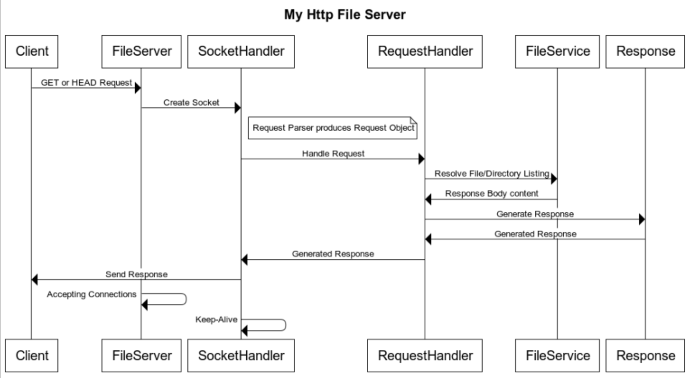

# My Http File Server

Basic HTTP/1.1 File Server which handles HEAD and GET requests and basic Keep-Alive behavior based on client Connection header.
## How to Run

1. Run `make build-image` to build Docker image.

2. Run `make run` to serve current working directory (default) OR
 run `make run ROOT_DIR=<User specified root directory>`.

3. Make HEAD or GET requests to `localhost:8080`.

## Architecture and Design

## Assumptions
* Clients make only valid HTTP/1.1 requests
* Although the server is multi-threaded, assumption was that it won't be overloaded with excessive requests
* The only relevant request header is `Connection: (Keep-Alive/Close)`

## Simplifications
These are the short-cuts/simplifications in order to meet time-constraints:
* Hard-coded Response Headers (For example, Content-Type is always `text/html; charset=UTF-8`)
* The only relevant request header is `Connection: (Keep-Alive/Close)`; the rest are ignored
* No proper logging
* Minimal exception, error, and edge-case handling (Assumption that clients make valid requests)
* Minimal thread management (e.g. no thread pool management or maximum thread count configuration)
* Basic Keep-Alive Behavior based on Connection header

## Approach
* My guiding principle was to follow Test-Driven Development as closely as possible, where feasible.
* I used [Simple Example](https://www.baeldung.com/a-guide-to-java-sockets#Example) from the `A Guide to Java Sockets` article by Baeldung as a starting point.
* Started with integration tests using [OkHttpClient](https://square.github.io/okhttp/4.x/okhttp/okhttp3/-ok-http-client/) to guide initial implementation.
* As FileServer covered more functionality, it was clear that multiple specific responsibilities began to emerge, and I could extract them out into classes with unit tests.
* Implemented multi-threading and Keep-Alive behavior last as they weren't straightforward to test
* By the end, the code doesn't resemble the start example by Baeldung much, only the key lines of code scattered throughout the FileServer and SocketHandler. A lot of the code evolved by considering how I could test it as components and separate responsibilities appropriately. 
However, I also reviewed [Design and Implementation of an HTTP Server](https://users.cs.jmu.edu/bernstdh/web/common/lectures/slides_http-server-example_java.php), not for the code, but more for verifying my design decisions.